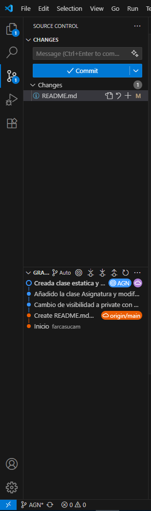
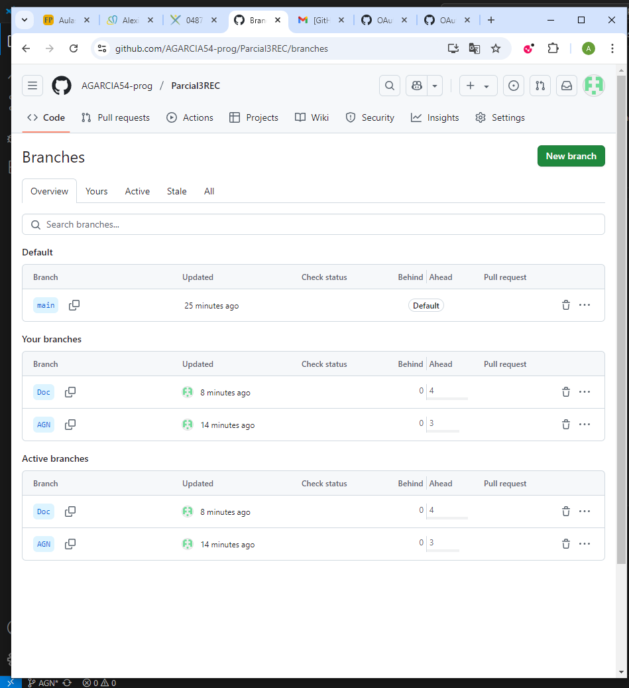

# Gestión de Alumnos

Autor: Alejandro Garcia Navarro

Este codigo implementa un sistema de gestion de alumnos y sus respectivas notas con 4 clases: Alumno, Asignatura, ListaAlumnos y Mensajes

Commits de mi proyecto: 

Vista de mi editos de codigo de ramas: 
